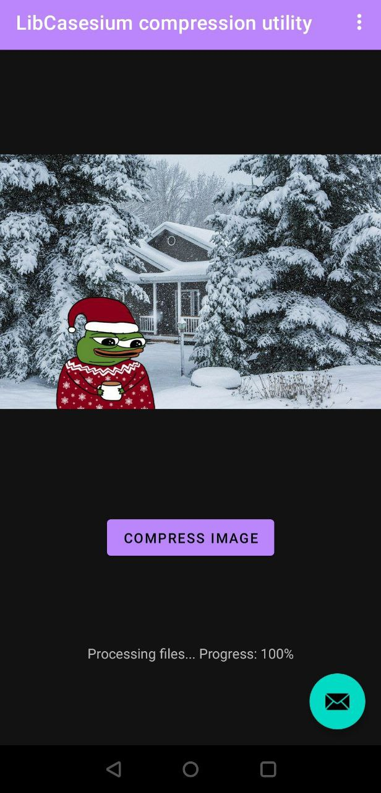
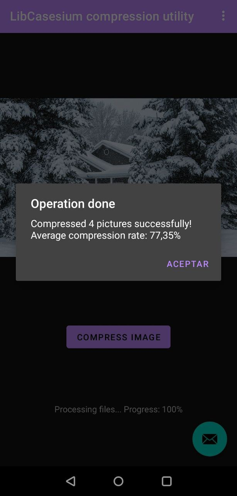

# Caesium Picture Compression Utility for Android

------

Hey y'all, this here's a real simple image batch compression app fer Android using the libcaesium library. It's got near lossless quality and can compress all sortsa images like JPG, PNG, GIF, and WEBP. Now, we had to rush this thing out, so some features ain't quite perfect yet. But don't you worry, we'll be updating it regular-like. This project uses [libcaesium](https://github.com/Lymphatus/libcaesium.git) as the main algorithm processing library and we modified it so it can make java calls to this native code.

### Steps you need to follow if you want to compile libcaesium JNI library by yourself

Well, since the main code of libcaesium is written in Rust, getting this project compiled and configured can be a real pain. So, I just went ahead and modified the c_compress() function in the original author's project file, then wrote a JNI function to call it. After all that, I compiled it into a dynamic link library file fer both arm32 and arm64 architectures. You can just use them straight up in your projects. Now, if you wanna improve the JNI part of the function, or if you need ta compile the dynamic link library fer the x86 architecture Android system, you're gonna hafta do it all from scratch. Here are the brief steps:

* Download NDK r21 from repository: https://github.com/android/ndk/wiki/Unsupported-Downloads
* Configure AR and CC path under [target.<arch>] in .cargo/config.toml, where <arch> can be one of them: *armv7-linux-androideabi, aarch64-linux-android, i686-linux-android, x86_64-linux-android*. Once they're got done, modify path after *-L* in *rustflags* to corresponding android library path. 
* Set additional environment variables to prevent the clang compiler from not finding the path to the corresponding toolchain:

```
set AR=D:/android-ndk-r21e/toolchains/llvm/prebuilt/windows-x86_64/bin/arm-linux-androideabi-ar.exe
set CC=D:/android-ndk-r21e/toolchains/llvm/prebuilt/windows-x86_64/bin/armv7a-linux-androideabi30-clang.cmd
```

* Install Install the rust build toolchain corresponding to the target architecture:

```
rustup target install aarch64-linux-android
```

* Go to build:

```
cargo build --target aarch64-linux-android --release
```

------

### Sceenshots:



